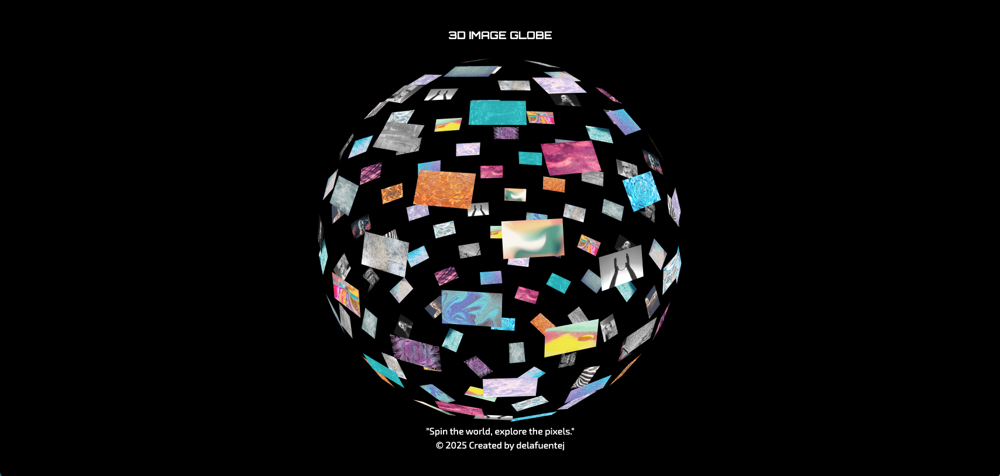

# 🌐🖼 3D Image Globe

A React-based 3D globe that displays images mapped on a sphere. Built with React, Three.js, and TailwindCSS, the globe allows user interaction via mouse or touch and asynchronously loads images for optimal performance.
This project is based on the tutorial **“MacBook Landing Page - GSAP, Three.js, React”** by **JavaScript Mastery**.



**Live Demo:** [three.js-3d-image-globe](https://3d-image-globe.vercel.app/)

---

## 🔥 Highlights

- Interactive 3D globe: Rotate, zoom, and explore images on a fully interactive 3D sphere.

- Smooth performance: Optimized animation loop only renders when needed.

- Responsive design: Automatically adjusts image sizes for different devices.

- Lazy loading: Loads the Globe component asynchronously for faster page load.

- Fibonacci sphere layout: Images are evenly distributed for an aesthetic visual.

---

## 🚀 Features

- Interactive 3D globe using Three.js

- Images evenly distributed on a sphere via Fibonacci sphere algorithm

- Lazy-loaded components for faster initial load

- Optimized animation loop to reduce unnecessary rendering

- Responsive image sizes for mobile and desktop

- Easy to configure sphere radius, number of images, and image dimensions

---

## 🛠 Technology Stack

This project leverages modern frontend and 3D technologies:

- React 19 – Frontend UI library for building reusable components

- Three.js 0.180 – 3D rendering engine used for the globe, meshes, and textures

- TailwindCSS 4 – Utility-first CSS framework for styling and responsive layouts

- Vite – Fast development server and build tool for modern JavaScript projects

- ESLint – Code linting tool to enforce best practices and maintain code quality

- WebGL – Graphics API underlying Three.js for high-performance 3D rendering in the browser

---

## 🛠️ Getting Started

```bash
# Clone the repo
git clone https://github.com/delafuentej/3d-image-globe.git
# Navigate into the project
cd 3d-image-globe

# Install dependencies
npm install
# or
yarn install

```
